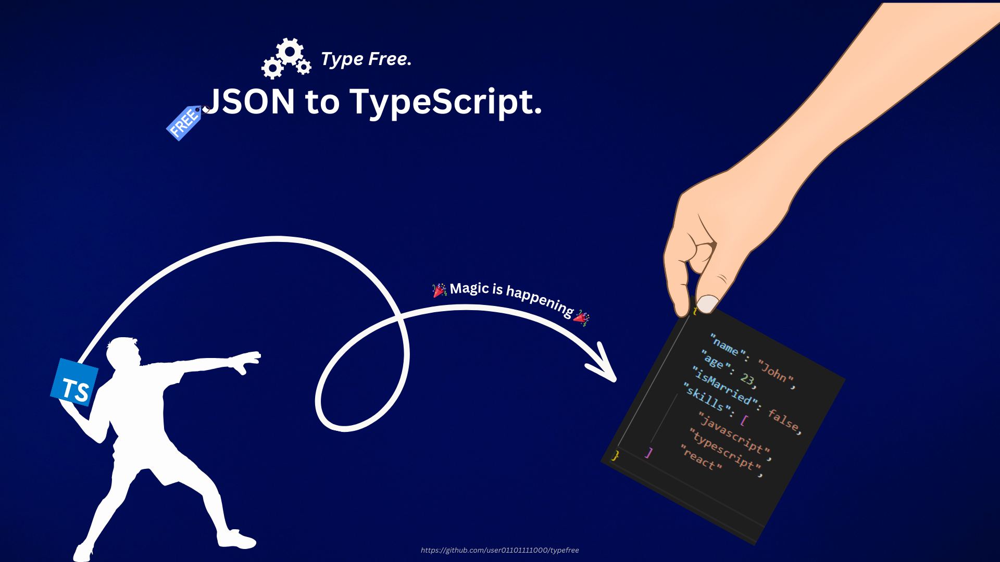

 
 

 
 

&nbsp;&nbsp;

## Getting Started 🚀

This tool makes it easy to generate TypeScript interfaces from JSON, helping developers save time and create accurate
type definitions effortlessly. Simply paste your JSON data and instantly get the output as a TypeScript interface or
type! Designed for developers working with TypeScript, this tool enhances type safety in projects. Its simple, fast, and
browser-based functionality means you can use it without any additional software installation. Try it now for a more
efficient development workflow !

## Features ✨

- Generate TypeScript interfaces from JSON data.
- Easy-to-use interface for developers.
- Fast and browser-based functionality.
- No additional software installation required.
- Simple and user-friendly interface.
- Supports JSON and TXT files.
- Free and open-source.
- Contributions and suggestions welcome!
- Built with love and care by [user01101111000](https://github.com/user01101111000).

## Usage 👨‍💻

1. Include JSON data in the JSON editor by copying and pasting, selecting a file, or retrieving data from a URL.
2. The created TypeScript interface will be displayed in the TypeScript editor.
3. You can get custom outputs by adjusting the settings according to your own preferences. (Optional)

## Settings ⚙️

### TypeScript ⚡
- **Root name**: The main identifier for the root element in a TypeScript project.
- **Prefix**: A string added before names to differentiate or categorize them.
- **Namespace**: A container that organizes and groups related code to avoid naming conflicts.
- **Flow**: The sequence and logic of code execution in a TypeScript program.

### Editor 🛠️
- **Font size**: The size of the text displayed in the editor.
- **Line height**: The vertical spacing between lines of text in the editor.
- **Map visible**: A setting that determines whether a minimap of the code is displayed.
- **Suggestions**: Automatic recommendations for code completion and corrections.
- **Folding**:  A feature that allows collapsing and expanding sections of code for better readability.
- **Show errors**: A setting that enables or disables the display of syntax and type errors.
- **Word wrap**: A feature that moves overflowing text to the next line instead of extending beyond the viewable area.
- **Line numbers**: Numbers displayed beside each line of code for easy reference.
- **Auto save**: A feature that automatically saves changes without requiring manual intervention.

## License 📄

This project is released under the [MIT License](https://github.com/user01101111000/typefree/blob/main/LICENSE). This project is free and open-source. You can use, modify, and distribute it as you wish. If you find this project useful,
please consider contributing back by [opening an issue](https://github.com/user01101111000/typefree/issues) or
[opening a pull request](https://github.com/user01101111000/typefree/pulls). Thank you for your support !